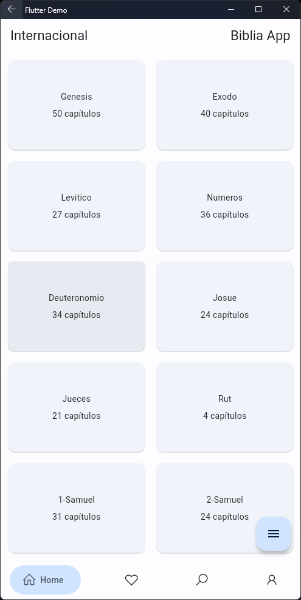

Claro, aquí tienes un ejemplo de archivo README para tu repositorio de GitHub para la aplicación Flutter llamada "Bible App". Este README incluirá instrucciones sobre cómo ejecutar la aplicación y cómo utilizar el comando `dart run build_runner watch`:

```markdown
# Bible App



Bible App es una aplicación de Flutter diseñada para facilitar la lectura y estudio de la Biblia. Ofrece una interfaz intuitiva y agradable que permite leer la Biblia, buscar en ella y guardar notas para tu estudio personal. 

## Requisitos previos

Antes de comenzar, asegúrate de tener instalados los siguientes elementos:

- [Flutter](https://flutter.dev/docs/get-started/install)
- [Dart](https://dart.dev/get-dart)
- [Git](https://git-scm.com/book/en/v2/Getting-Started-Installing-Git)

## Instalación

1. Clona este repositorio en tu máquina local usando Git:

   ```bash
   git clone https://github.com/Daizaikun/BiblieApp-Mobile.git
   ```

2. Navega al directorio del proyecto:

   ```bash
   cd bible-app
   ```

3. Ejecuta el siguiente comando para obtener las dependencias:

   ```bash
   flutter pub get
   ```

## Ejecución

Para ejecutar la aplicación de Bible App en tu dispositivo o emulador, sigue estos pasos:

1. Asegúrate de que tienes un dispositivo conectado o un emulador en ejecución.

2. Ejecuta el siguiente comando en el directorio del proyecto:

   ```bash
   flutter run
   ```

La aplicación se compilará y se lanzará en tu dispositivo o emulador.

## Uso

- Al abrir la aplicación, podrás seleccionar la versión de la Biblia que deseas leer.

- Utiliza la función de búsqueda para encontrar versículos específicos o pasajes en la Biblia.

- Guarda tus notas y pensamientos personales mientras estudias la Biblia.

- ¡Disfruta de una experiencia de lectura fluida y enriquecedora!

## Desarrollo

Si estás trabajando en el desarrollo de la aplicación y necesitas generar código automáticamente o realizar tareas de compilación, puedes utilizar el siguiente comando:

```bash
dart run build_runner watch
```

Este comando ejecutará el generador de código y observará cambios en tu código fuente para realizar compilaciones automáticas.

## Contribuciones

Si deseas contribuir a este proyecto, te invitamos a abrir un [issue](https://github.com/Daizaikun/BiblieApp-Mobile/issues) o enviar una [pull request](https://github.com/Daizaikun/BiblieApp-Mobile/pulls).

## Licencia

Este proyecto está bajo la licencia [LICENSE](LICENSE).

---

¡Esperamos que disfrutes usando Bible App para tu estudio bíblico! Si tienes alguna pregunta o encuentras algún problema, no dudes en [contactarnos](mailto:laiglesias.min@gmail.com).
```
